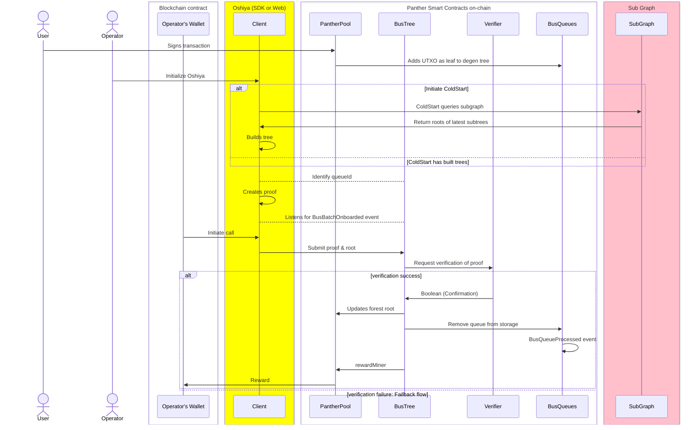

# Process Flow

The process flow for the operation of Oshiya can be considered in two main steps, being Cold Start and mining.

1. **Cold Start** In order to efficiently create a proof of inclusion of a batch of transactions in the Merkle Tree (MT), Oshiya firstly builds replica tree to that stored on chain.

To do this in an effective manner, Oshiya calls a SubGraph, which stores the roots of latest subtrees. The client then uses these subtrees to effectively build the BusTree MT in its current state in local storage.

Thereafter, if a parallel miner successfully mines, inserting a queue into the BusTree on chain, Oshiya can use data emitted in events to keep the tree in local storage up to date and use it effectively to further generate proofs/mine queues.

2. **Batch Processing** Once the tree is up to date, Oshiya can begin to process batches of UTXOs.

The process of batch processing can be broken down into the following steps:

-   **Find Oldest Pending Queues** Oshiya retrieves the oldest pending queue from the BusTree Smart Contract (SC).
-   **Queue Nomination** Oshiya nominates 1-in-5 of oldest pending queues for processing.
-   **Batch Creation** Oshiya reads returned UTXOs from the selected queue and forms them into a binary tree of depth 64.
-   **Queue SNARK Proof Generation** Oshiya generates a SNARK proof for the insertion of the root as a leaf, proving its legitimacy and inclusion in the BusTree MT.
-   **Queue Submission** Oshiya submits the SNARK proof, along with the newly proposed root, to the BusTree SC.
-   **Queue Validation** The `queueId` passed to the SC is compared with the root of the corresponding degenerate tree stored in the BusQueues SC. If it doesn't match, the process reverts. This simultaneously prevents malicious actors from inserting false queues.
-   **Proof Verification** The verifier SC validates the proof and, if successful, updates the root of the BusTree SC's MT.
-   **Storage Clean Up** Once a queue of given ID is successfully inserted into the BusTree on chain, the corresponding queue is removed from the BusQueue's SC storage.
-   **Event Emission** BusTree SC emits the event `BusBatchOnboarded` with the new root and the `queueId` of the batch that was inserted. This allows for a recursive process, where Oshiya operators can continuously and concurrently mine new batches of UTXOs.

